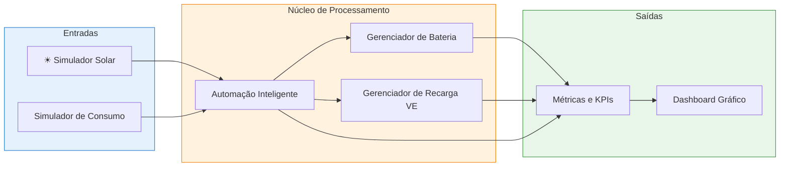
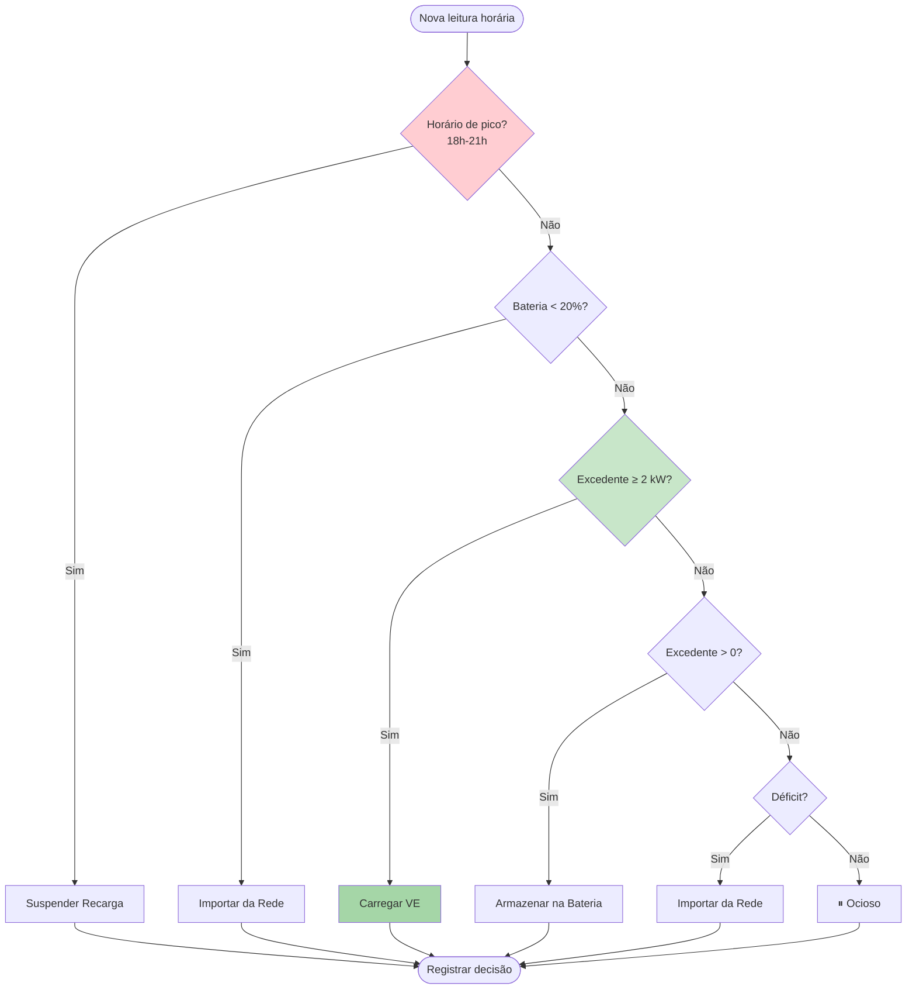

#  Sistema Inteligente de Gestão Energética Solar

**Sprint 3**  
**FIAP**

---

##  Sumário

- [Sobre o Projeto](#-sobre-o-projeto)
- [Equipe](#-equipe)
- [Arquitetura do Sistema](#-arquitetura-do-sistema)
- [Automação Inteligente](#-automação-inteligente)
- [Tecnologias Utilizadas](#-tecnologias-utilizadas)
- [Estrutura do Repositório](#-estrutura-do-repositório)
- [Como Executar](#-como-executar)
- [Resultados Obtidos](#-resultados-obtidos)
- [Conexão com a Disciplina](#-conexão-com-a-disciplina)
- [Sustentabilidade e Impacto](#-sustentabilidade-e-impacto)

---

##  Sobre o Projeto

Este projeto implementa um **sistema integrado de gestão energética** que combina:

- ️ **Geração solar fotovoltaica** (5 kWp)
-  **Banco de baterias** (10 kWh) para armazenamento
-  **Estação de recarga de veículo elétrico** (7 kW)
-  **Automação inteligente** com tomada de decisão em tempo real
-  **Análise de dados com Python** (métricas, gráficos, KPIs)

O sistema simula um dia completo de operação, tomando **decisões automáticas** sobre quando:

1. Carregar o veículo elétrico (priorizando energia solar)
2. Armazenar excedente na bateria
3. Importar da rede elétrica (último recurso)
4. Suspender operações durante horário de pico tarifário

>  **Objetivo:** Demonstrar como energia renovável + automação + análise de dados podem trabalhar em sinergia para **reduzir custos, emissões de CO₂ e dependência da rede**.

---

##  Equipe

| Nome | RM |
|---|---|
| João Guilherme Figueiredo | 572697 |
| Enzo Ricardo Silva | 571333 |
| Eric Hernandes Penhalbel | 574085 |
| Matheus Borges Soares | 570237 |
| Ryan Luther Roque | 572993 |

---

##  Arquitetura do Sistema

O sistema é dividido em **módulos independentes** que se comunicam por meio de uma camada de automação central:



### Fluxo de dados

1. **`simulador_solar.py`** gera a curva de geração horária (gaussiana com pico ao meio-dia)
2. **`simulador_consumo.py`** gera o perfil de consumo residencial
3. **`automacao.py`** recebe geração + consumo + estado da bateria e **decide** o que fazer
4. **`gerenciador_bateria.py`** e **`gerenciador_recarga.py`** executam as ações
5. **`metricas.py`** consolida KPIs (CO₂, economia, eficiência)
6. **`dashboard.py`** gera o gráfico final

---

##  Automação Inteligente

O coração do sistema é o módulo `automacao.py`, que aplica **6 regras de decisão** em ordem de prioridade:



### Detalhamento das regras

| # | Condição | Ação | Justificativa |
|---|---|---|---|
| 1 | Horário entre 18h e 21h | Suspender recarga | Tarifa de pico (R$ 1,20/kWh) |
| 2 | Bateria < 20% | Importar da rede | Proteção contra descarga profunda |
| 3 | Excedente ≥ 2 kW | Carregar VE | Aproveitamento máximo do sol |
| 4 | Excedente > 0 | Armazenar na bateria | Prioriza autoconsumo |
| 5 | Déficit energético | Importar da rede | Cobre o que solar não supre |
| 6 | Equilíbrio perfeito | Ocioso | Sem excedente nem déficit |

---

## 🛠 Tecnologias Utilizadas

| Tecnologia | Versão | Uso |
|---|---|---|
| Python | 3.9+ | Linguagem principal |
| pandas | 2.0+ | Manipulação de dados |
| numpy | 1.24+ | Cálculos numéricos |
| matplotlib | 3.7+ | Visualização gráfica |
| dataclasses | nativo | Estruturas de dados tipadas |
| enum | nativo | Enumeração de ações |

**Justificativa das escolhas:**

- **Python:** linguagem padrão para análise de dados, exigida pela disciplina
- **dataclasses:** código limpo, tipado e auto-documentado
- **matplotlib:** gera gráficos prontos para apresentação no vídeo
- **Sem dependências externas pesadas:** fácil de clonar e rodar em qualquer ambiente

---

##  Estrutura do Repositório

```
Sprint Tritiack/
│
├── main.py                      
├── requirements.txt             
├── .gitignore                   
├── README.md                    
│
├── src/
│   ├── __init__.py              
│   ├── config.py                
│   ├── simulador_solar.py       
│   ├── simulador_consumo.py     
│   ├── gerenciador_bateria.py   
│   ├── gerenciador_recarga.py   
│   ├── automacao.py             
│   ├── metricas.py              
│   └── dashboard.py             
│
└── output/
    └── graficos/
        └── dashboard_energia.png
```

---

##  Como Executar

### Pré-requisitos

- Python 3.9 ou superior
- pip instalado

### Passo a passo

```bash
# 1. Clonar o repositório
git clone https://github.com/Twerthzin/ChargeGrid-Sprint-3.git

# 2. (Opcional) Criar ambiente virtual
python -m venv venv

# Windows:
venv\Scripts\activate
# Linux/Mac:
source venv/bin/activate

# 3. Instalar dependências
pip install -r requirements.txt

# 4. Executar a simulação
python main.py
```

### Saída esperada

- Tabela com decisões horárias no terminal
- Métricas finais (energia, CO₂, economia, eficiência)
- Gráfico salvo em `output/graficos/dashboard_energia.png`

---

##  Resultados Obtidos

### Simulação de um dia (dados gerados pelo sistema)

| Métrica | Valor |
|---|---|
| Energia gerada | **31,60 kWh** |
| Energia consumida | 20,60 kWh |
| Energia recarregada no VE | **15,36 kWh** |
| Energia importada da rede | 2,81 kWh |
| **Eficiência do sistema** | **91,20%** |
| CO₂ evitado | **2,654 kg/dia** |
| Equivalente em árvores | 0,1475 árvores/ano |
| Economia financeira | **R$ 23,70/dia** |

### Projeções anuais

| Métrica | Valor anual |
|---|---|
| CO₂ evitado | **~969 kg/ano** |
| Árvores equivalentes | **~54 árvores/ano** |
| Economia financeira | **~R$ 8.650/ano** |

### Comportamento observado

- ️ **Curva solar realista:** pico de 4,22 kW às 12h, decaindo suavemente
-  **Recarga do VE:** 1 sessão contínua das 10h às 18h (100% solar)
-  **Bateria:** variou entre 35,8% e 54,2%, sem atingir limites críticos
-  **Suspensão inteligente:** recarga interrompida às 18h (horário de pico)

---

##  Conexão com a Disciplina

Este projeto aplica diretamente os conceitos estudados:

| Conceito da disciplina | Aplicação no projeto |
|---|---|
| **Análise de dados com Python** | Processamento horário, agregações, KPIs |
| **Estruturas de dados** | `dataclasses` para modelar leituras e decisões |
| **Programação orientada a objetos** | Classes com responsabilidade única |
| **Modularização** | 8 módulos independentes e testáveis |
| **Visualização de dados** | Matplotlib com gráficos compostos |
| **Automação** | Sistema de regras de decisão encadeadas |
| **Sustentabilidade** | Cálculo de CO₂ evitado e eficiência energética |

---

##  Sustentabilidade e Impacto

### Ambiental
- **Zero emissão durante operação** — energia 100% solar
- **~969 kg de CO₂ evitado por ano** (equivalente a ~54 árvores)
- **Redução da dependência de fontes fósseis**

### Econômico
- **~R$ 8.650 de economia anual** para o usuário
- **Priorização de autoconsumo** (evita tarifas de pico)
- **Valorização do imóvel** com infraestrutura de recarga

### Técnico
- **Sistema escalável** para diferentes portes
- **Compatível com hardware real** (sensores, inversores, PLCs)
- **Base para integração com IoT e dashboards em nuvem**

---

##  Vídeo de Demonstração

https://youtu.be/4WoDNm7HMCo

---

##  Licença

Projeto acadêmico desenvolvido para a FIAP — Sprint 3.  
Uso livre para fins educacionais.

---

**Desenvolvido com <3 por alunos da FIAP — 2026**